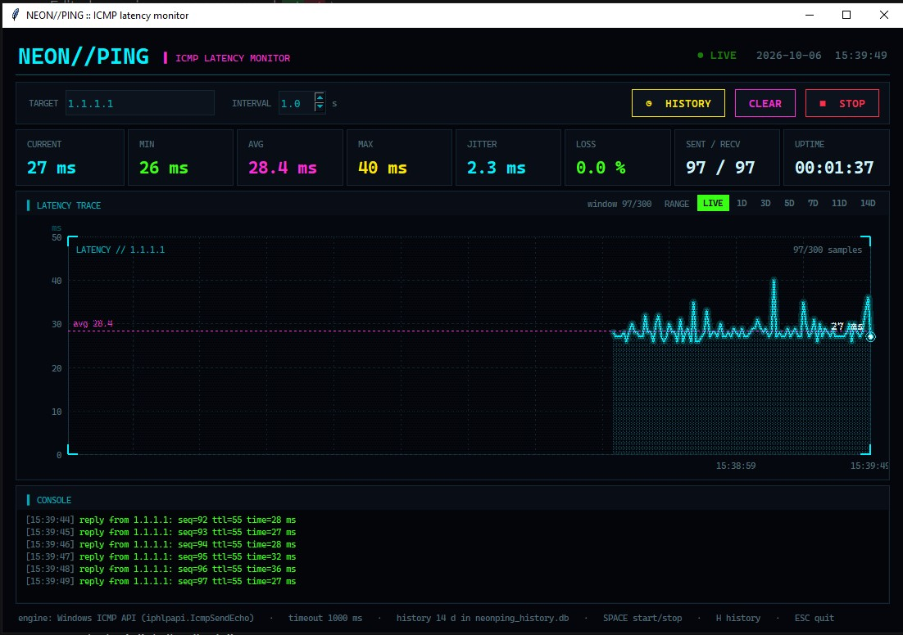

# NEON//PING

NEON//PING is a cyberpunk-styled ICMP latency monitor written in Python with nothing but the standard library (tkinter + sqlite3). It pings a target (1.1.1.1 by default) continuously, draws the last 300 round-trip times as a neon trace with live stats for current / min / avg / max / jitter / loss, and logs every reply to a hacker-style console. Every probe is also stored in a local SQLite database, so the HISTORY view can show aggregated latency and packet loss for the last 1, 3, 5, 7, 11 or 14 days. On Windows it uses the native ICMP API (no admin rights needed); on Linux and macOS it falls back to the system `ping` binary.

## Run

```
python neonping.py
```

On Windows you can also double-click `start.bat` or run `.\start.ps1` (add `--console` / `-Console` to keep a console window open for debugging). Requires Python 3.8+.
